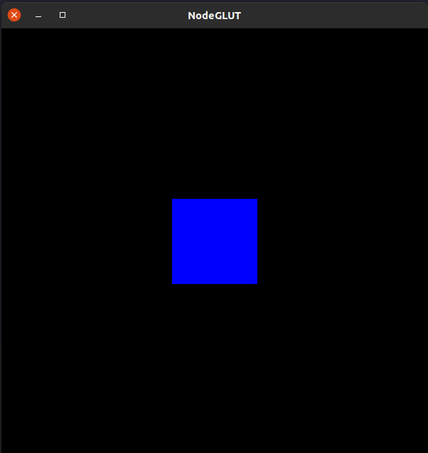

<p align="center">
  
</p>

# NodeGLUT - FreeGLUT bindings for Node.JS

This project ports FreeGLUT C/C++ calls to Node.JS using N-API.
All callable functions in `freeglut.h` are binded, including
functions that depend on pointers or non-javascript sized variables
such as float, short and byte.

## Dependencies

- Linux (For now, only linux headers are used on this project)
- FreeGLUT v3
- CMake (Minimum v3)
- GCC or Clang

## Installing


Using Npm:
```
npm install nodeglut
```
Using Yarn:
```
yarn add nodeglut
```

## Usage

This package focuses on having only FreeGLUT bindings, OpenGL is not included, so you
will need some package to call OpenGL drawing functions. The example below uses a [OpenGL port](https://github.com/EnzoAlbornoz/nodegl), made by me, that binds core functions of OpenGL v1.1.

```javascript
// Import Libs
const glut = require("nodeglut");
const gl = require("nodegl");
// Setup Code
function main() {
	// Init GLUT
	glut.glutInit(process.argv.length, process.argv);
	// Define Constants
	const WINDOW_WIDTH = 600;
	const WINDOW_HEIGHT = 600;
	// Create Window
	glut.glutInitWindowSize(WINDOW_WIDTH, WINDOW_HEIGHT);
	const window = glut.glutCreateWindow(
		"NodeGLUT"
	);
	// Get Buffer Size
	glut.glutReshapeFunc((fbW, fbH) => {
		gl.glViewport(0, 0, fbW, fbH);
		gl.glMatrixMode(gl.GL_PROJECTION);
	});
	// Pre Loop
	gl.glClearColor(0.0, 0.0, 0.0, 1.0);
	gl.glMatrixMode(gl.GL_PROJECTION);
	gl.glLoadIdentity();
	gl.glOrtho(-15.0, 15.0, -15.0, 15.0, -15.0, 15.0);
	// Main
	function loop() {

		// Clear the screen
		gl.glClear(gl.GL_COLOR_BUFFER_BIT);
		// Draw a blue square
		gl.glBegin(gl.GL_QUADS);
		gl.glColor3d(0.0, 0.0, 1.0);
		gl.glVertex3d(-3.0, -3.0, 0.0);
		gl.glVertex3d(3.0, -3.0, 0.0);
		gl.glVertex3d(3.0, 3.0, 0.0);
		gl.glVertex3d(-3.0, 3.0, 0.0);
		gl.glEnd();
		// Draw - End
		glut.glutSwapBuffers();
		gl.glFlush();
	}
	// Define Show Loop (60 FPS)
	glut.glutDisplayFunc(loop);
	const rl = () => {
		glut.glutPostRedisplay();
		glut.glutTimerFunc(parseInt(1000/60), rl, 0);
	}
	glut.glutTimerFunc(parseInt(1000/60), rl, 0);
	// Show Window
	glut.glutMainLoop();
	// Exit Program
	process.exit(0);
}
// Start
main();
```
As result of the above code we have:

<p align="center">
  
</p>

## Differences between NodeGLUT and FreeGLUT

- glutInitErrorFunc :

```
Before:
glutInitErrorFunc(void (*callback) (const char* fmt, va_list ap))

After:
glutInitErrorFunc((message: String) => void)
```

- glutInitWarningFunc :

```
Before:
glutInitWarningFunc(void (*callback) (const char* fmt, va_list ap))

After:
glutInitWarningFunc((message: String) => void)
```

- glutGetProcAddress : Returns a raw C pointer (BigInt)

## Warnings

I'm investigating some cases of memory leaking on some functions (like `glutIdleFunc`) that are called multiple times in a short period of time. If you can help me, open a PR with your changes that I will review it

## License
This package is licensed under MIT License. You can see more about it [here](./LICENSE.md)
